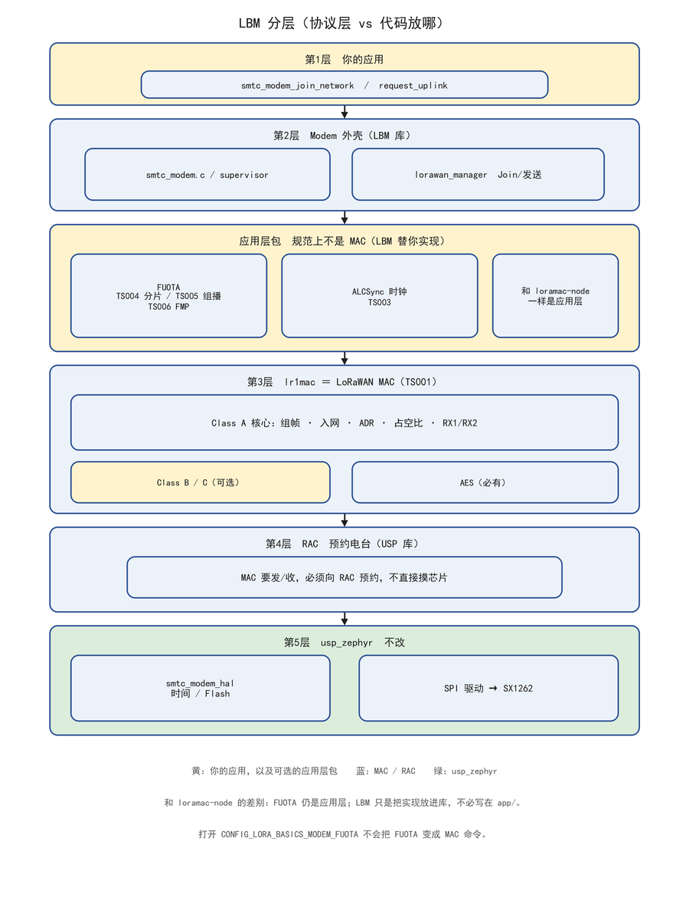
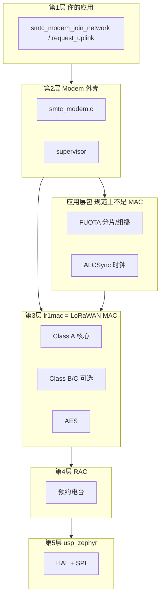
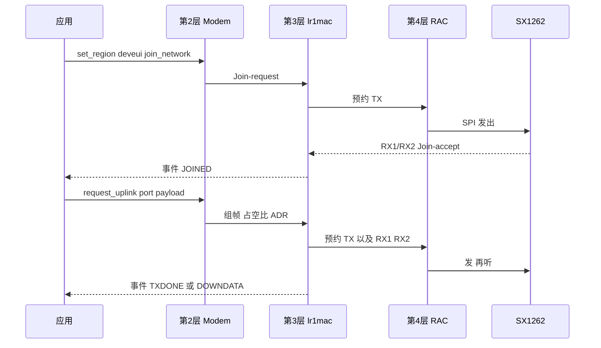

# LoRa Basics Modem（LBM）分层

**LBM** = Semtech 的 **LoRaWAN 协议栈**（TS001 L2 1.0.4 + 区域参数 RP2-1.0.3）。它不认识 Zephyr，也不直接读写 SX1262 寄存器。

源码在 `usp` 仓：`modules/lib/usp/protocols/lbm_lib/`。接到 Zephyr 上的办法见 [usp_zephyr 框架](./usp_zephyr-framework.md) §2.1。

官方：[lbm_lib README](https://github.com/Lora-net/usp/blob/main/protocols/lbm_lib/README.md)、应用头文件 `[smtc_modem_api.h](https://github.com/Lora-net/usp/blob/main/protocols/lbm_lib/smtc_modem_api/smtc_modem_api.h)`。

---

## 1. 先看这张方框图

从上到下五层，大框套小框。你日常只碰最上面黄框。

打开本文件后请用 Markdown 预览（`Ctrl+Shift+V`）。





读图顺序：

1. **第1层** — 你的 `app/`，只调 `smtc_modem_*`。
2. **第2层** — LBM 外壳，把 API 变成内部任务。
3. **应用层包** — FUOTA、ALCSync 等（TS003–TS007）。**协议上是应用层**，和 loramac-node 一样；LBM 只是把代码收进了库里，你不必在 `app/` 里自己写。
4. **第3层 lr1mac** — 真正的 LoRaWAN MAC（TS001）：Class A，可选 Class B/C，AES。
5. **第4层 RAC** — 预约电台。
6. **第5层** — usp_zephyr HAL / SPI。

箭头 = 调用方向（应用往下走）。

一句话：**lr1mac 是 MAC；FUOTA 仍是应用层包，只是 LBM 替你实现了，不必写在 app/ 里。**

在 USP + Zephyr 上不要再叠一套 Zephyr 自带的 `CONFIG_LORAWAN`。

---

## 2. 各层干什么

### 第 1 层：应用 API（你写的代码）

头文件在 `smtc_modem_api/`：


| 你调用                                                                   | 含义                  |
| --------------------------------------------------------------------- | ------------------- |
| `smtc_modem_init(callback)`                                           | 注册事件回调，启动栈          |
| `smtc_modem_set_region` / `set_deveui` / `set_joineui` / `set_nwkkey` | 入网参数                |
| `smtc_modem_join_network`                                             | OTAA 入网             |
| `smtc_modem_request_uplink`                                           | 已入网后发一包             |
| `smtc_modem_run_engine`                                               | **必须周期性调用**，推进内部状态机 |
| `smtc_modem_get_event`                                                | 在 callback 里把事件取完   |


默认 **OTAA**。ABP 只给调试，官方不建议产品用（上下文几乎不写 NVM）。

应用不组 MHDR/FHDR，也不算 Join 重试间隔。那些在第 2、3 层。

### 第 2 层：Modem 外壳（`smtc_modem_core/` 上半）


| 目录 / 文件             | 角色                                 |
| ------------------- | ---------------------------------- |
| `smtc_modem.c`      | API 的实现：把 `join` / `uplink` 变成内部任务 |
| `modem_supervisor/` | 轻量调度：何时 join、何时 TX、何时处理下行          |
| `lorawan_manager/`  | Join、发送、CID、下行 ACK、Class B 管理      |
| `lorawan_api/`      | 给外壳用的 LoRaWAN 内部接口                 |
| `modem_utilities/`  | 事件队列、FIFO、core 辅助                  |


`smtc_modem_run_engine()` 主要就是跑这一层：看有没有到期任务、有没有中断，然后决定下一件事，并返回「过多久再叫醒我」（毫秒）。

### 第 3 层：LoRaWAN MAC（`lr1mac/`）

**lr1mac** 才是 MAC（TS001）：Class A 空口帧、ADR、占空比、LBT、区域（`smtc_real`）。Class B/C、CSMA、multicast、AES 也属于这一层或紧贴这一层。

**FUOTA 不在 MAC 里。** 它是 LoRa Alliance 的**应用层包**（走 FPort 上的应用载荷，不是 MAC Command）：

| 规范 | 内容 |
|------|------|
| TS003 | ALCSync 应用层时钟同步 |
| TS004 | 分片传输（固件块） |
| TS005 | 远程组播建立 |
| TS006 | FMP 固件管理 |
| TS007 | MPA 多包访问 |

loramac-node / Zephyr `subsys/lorawan`：MAC 在栈里，FUOTA 通常写在**应用**或 LmHandler。
LBM：这些包的**实现**在 `lorawan_packages/`，和 lr1mac 一起编进 modem 库，所以方框图看起来像「进了栈」。协议分层没变——仍骑在 MAC 上面，只是你不用在 `app/` 里自己实现。

`prj.conf` 打开 `CONFIG_LORA_BASICS_MODEM_FUOTA` 只是把应用层包链进库，不会把 FUOTA 变成 MAC 命令。

其它可选（同样不是 MAC）：`modem_services/`（Stream、大文件等）、`geolocation_services/`。

区域（EU868、US915、AS923、CN470…）在编译期勾选，运行时 `smtc_modem_set_region()` 选定。中国常用 **CN470** 或 AS923 组，以网关/NS 为准。

### 第 4 层：谁占用射频

老 LBM 内部有 **radio planner**，自己排 TX/RX。

接到 **USP** 后：LoRaWAN 要发/收，改走 **RAC**（Radio Access Controller）。所以同一颗芯片上还可以排测距等别的协议，由 RAC 按优先级打断或推迟。

因此 USP 上的 `main` 是：

```c
smtc_rac_init();                 /* 第 4 层先起来 */
smtc_modem_init(&callback);      /* 再挂 LBM */

while (1) {
    smtc_modem_run_engine();     /* 第 2 层 */
    smtc_rac_run_engine();       /* 第 4 层 */
}
```

只跑 modem engine 不够：MAC 已经把「请发」交给 RAC 了。

### 第 5 层：HAL（LBM 仓里只有头文件）

`smtc_modem_hal.h` 规定：当前时间、延时、NVM（DevEUI/会话）、随机数、看门狗、打印。

**实现不在 LBM 里。** Zephyr 上的实现是 `usp_zephyr/modules/smtc_modem_hal/smtc_modem_hal.c`。电台 SPI/复位/BUSY/DIO 在 `usp_zephyr/drivers/usp/`。

LBM 文档写的最低资源大约：Class A 单区域 ~40 KB Flash、~6 KB RAM、NVM 至少约 48 B（软件 SE 可到 512 B）、一个定时器、一路 SPI。

---

## 3. 源码目录和层的对应

```text
protocols/lbm_lib/
  smtc_modem_api/          第 1 层：你 include 的头
  smtc_modem_core/
    smtc_modem.c           第 2 层
    modem_supervisor/
    lorawan_manager/
    lorawan_api/
    lr1mac/                第 3 层 MAC（TS001）
    lorawan_packages/      应用层包（FUOTA 等，不是 MAC）
    modem_services/
    smtc_modem_crypto/
    radio_planner/         第 4 层（非 USP 路径）
  smtc_modem_hal/          第 5 层：只有接口
```

---

## 4. 一次上行怎么穿过这些层

OTAA 入网后再 `request_uplink`：




应用侧用 **事件** 得知结果，不要把 `request_uplink` 当成阻塞发送：

- `SMTC_MODEM_EVENT_JOINED` / `JOINFAIL`
- `SMTC_MODEM_EVENT_TXDONE`（未发出 / 已发 / 已确认）
- `SMTC_MODEM_EVENT_DOWNDATA` 后再 `smtc_modem_get_downlink_data()`

callback 里循环 `smtc_modem_get_event()`，直到返回 `SMTC_MODEM_RC_NO_EVENT`。

---

## 5. 你要配的 vs 栈自己做的

**你配 / 你调：**

- 区域、DevEUI、JoinEUI、AppKey（nwkkey）
- `join_network`、`request_uplink`
- `prj.conf` 里打开 Class C、FUOTA 等（变成 LBM 的 `ADD_*` 宏）
- 周期调用 `run_engine`（或让 `CONFIG_USP_MAIN_THREAD` 代跑）

**栈自己做：**

- Join 重试与占空比
- Class A 的 RX1/RX2
- ADR、确认重传
- 和网关的 MAC 命令

RAK4631 第一版通常：OTAA + Class A + 一个区域 + 周期 uplink。Class B/C、FUOTA、定位以后按需在 `prj.conf` 打开。

---

## 6. 和 USP / usp_zephyr 各管什么


|            | 负责                                         |
| ---------- | ------------------------------------------ |
| LBM        | LoRaWAN 语义（join、MAC、区域、包）                  |
| RAC        | 多协议抢同一颗电台                                  |
| usp_zephyr | 用 Zephyr 实现 HAL + 把 LBM `.c` 编进固件 + 板级 dts |


LBM 可以跑在裸机或别的 RTOS 上；换平台只改第 5 层 HAL。Zephyr 只是其中一种 HAL 实现。

---

## 7. 先记这三句

1. **LBM 是 LoRaWAN 状态机**，不是电台驱动。
2. **你只调 `smtc_modem_`*，并周期 `run_engine`。**
3. **在 USP 上射频入口是 RAC**，所以还要 `smtc_rac_init` / `smtc_rac_run_engine`。

