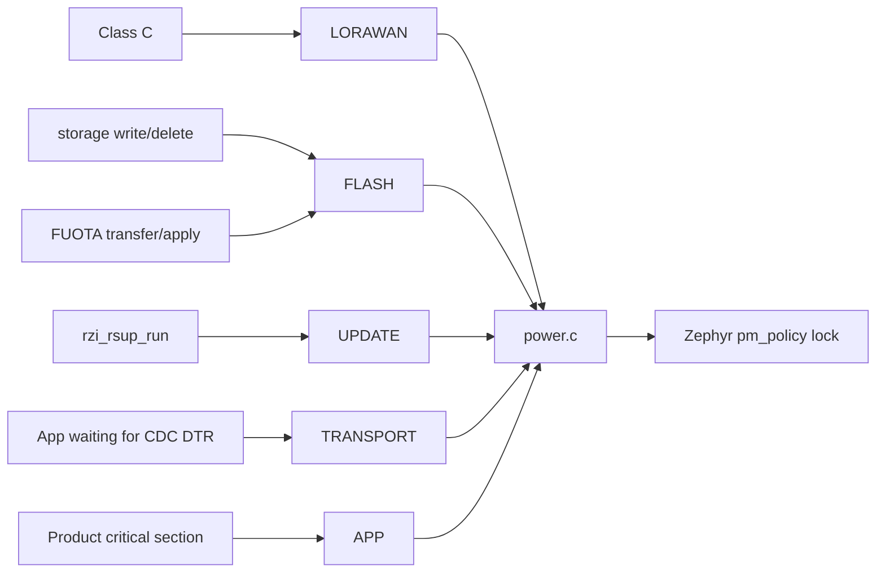
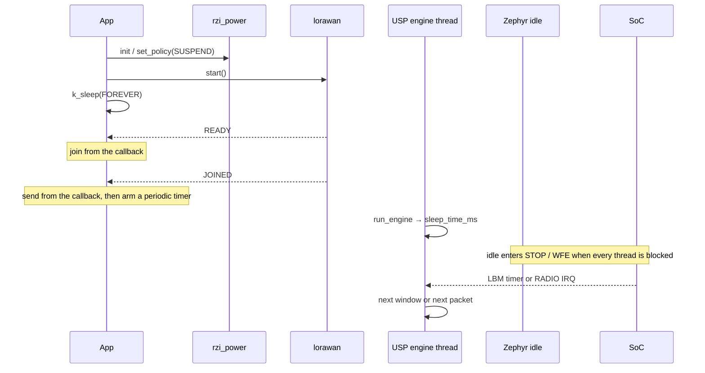

# Power management

Status: implemented

Product sleep-policy coordinator. Current targets remain a product
acceptance item and are not promised here.

See also: [power-api.md](./power-api.md), [architecture.md](./architecture.md)
§11.

## 1. Problem

Both product boards must sleep, but the reachable depth differs:

- **4631 / nRF52840**: everyday sleep is System ON + WFE. The SoC DTS has
  no `cpu-power-states`, so `CONFIG_PM` cannot enter STOP. Power-off is
  System OFF: RAM is lost, and only GPIO / USB can wake. Boards also often
  carry USB CDC.
- **3372 / STM32WLE5**: DTS already has STOP0/1/2. Battery nodes target
  STOP2 in idle. On-chip SUBGHZ wakes through EXTI. The system timer is
  already LPTIM1 + LSE. Power-off is STANDBY/shutdown.

Only the backend (USP / LBM or Zephyr lorawan) knows LoRaWAN RX1/RX2
timing. If RZI computed the windows itself, it would race the stack. The
power service therefore **does not touch the radio schedule**.

RZI also does not gate clocks, switch regulators, or write PWR registers.
Those belong to Zephyr PM and the SoC drivers.

This component does one job: **product policy coordination**. Who must not
sleep deeply right now, how deep the product wants to sleep, and the next
time the device must be awake are collected by RZI. The actual power
transition is left to the idle thread and `sys_poweroff()`.

## 2. Layers and ownership

```text
Application / AT
    │  policy, TRANSPORT/APP blockers, wake source, sleep/shutdown
    ▼
include/rzi/power/power.h          Sole public entry
    │
src/power/power.c            Coordinator: policy × blocker → Zephyr constraint
    │
┌───┴──────────────────────────────┐
│ LoRaWAN / storage / RSUP / FUOTA │  Auto take/release blockers (optional)
└──────────────────────────────────┘
    │
    ▼
Zephyr
    idle thread / CONFIG_PM / pm_policy_* / sys_poweroff()
    │
    ▼
SoC
    nRF52840 System ON WFE / System OFF
    STM32WLE5 STOP0/1/2 / STANDBY
```

| Layer | Owns | Does not own |
|---|---|---|
| Application | Policy, TRANSPORT/APP, GPIO/USB wake pins, when to `sleep` / `shutdown` | Protocol windows, SoC registers |
| RZI power | Policy, blocker counts, PM locks, wake deadline, advisory wake-source mask, reset cause | RX1/RX2, DIO1 setup, device runtime PM |
| Other RZI services | Their own blockers during an operation | Sleep depth |
| LoRaWAN backend | Protocol timing, radio IRQ, Class A RX windows | Product policy |
| Zephyr / SoC | Idle, STOP, System OFF, peripheral PM | Product semantics |

`CONFIG_RZI_POWER=y` enables the coordinator. 3372 therefore `select`s
`PM`. 4631 does **not** enable system `CONFIG_PM`, so the idle path is not
empty when there are no power-states. Both `select POWEROFF` when the SoC
supports it, for explicit shutdown.

## 3. Core model

The coordinator has four pieces of state. They compose an internal
constraint, then map onto Zephyr.

```text
policy          How deep the product wants to sleep (RUN / IDLE / SUSPEND / SHUTDOWN)
blocker[]       Who must not sleep deeply now (reentrant counts)
wake_deadline   Next absolute uptime the device must be awake (optional)
wake_sources    Advisory mask: checked before shutdown can leave power-off
        │
        ▼
constraint = f(policy, blockers)
        │
        ├── ALL      Lock every PM state (RUN, or SHUTDOWN waiting for explicit power-off)
        ├── NO_DEEP  Forbid STOP and deeper (IDLE, or any blocker)
        └── NONE     Allow the deepest RAM-retaining sleep (SUSPEND and no blockers)
```

`rzi_power_sleep()` is **not** a state-machine entry. It only suspends the
calling thread for a while under the current constraint. The Zephyr idle
thread is what actually puts the CPU into low power: when every thread is
blocked, 3372 PM may choose STOP and 4631 uses `arch_cpu_idle()` / WFE.

`rzi_power_shutdown()` is the power-off path. Idle **never** System OFFs by
itself. SHUTDOWN policy first locks every PM state so idle does not enter
STOP and then fight an explicit power-off.

## 4. How policy lands on the two boards

| Policy | Meaning | 4631 | 3372 |
|---|---|---|---|
| `RUN` | Stay awake | WFE may still happen (nothing to lock without `CONFIG_PM`); the meaning is "do not sleep on purpose" | Lock every STOP |
| `IDLE` | CPU wait only | **Default**. System ON + WFE | WFI, no STOP |
| `SUSPEND` | Deepest RAM-retaining sleep | Same as IDLE (no STOP to enter) | **Default**. Allow STOP0/1/2 |
| `SHUTDOWN` | Power-off that loses RAM | Explicit System OFF | Explicit STANDBY/shutdown |

Kconfig defaults: `SOC_SERIES_STM32WLX` → SUSPEND, other boards → IDLE.
Applications may change this at runtime with `rzi_power_set_policy()`.

Any non-zero blocker demotes SUSPEND to NO_DEEP: 3372 must not enter STOP
in the middle of a join, a flash write, or a USB session. On 4631, NO_DEEP
and NONE are both no-ops for system PM. Blockers still stop
`rzi_power_shutdown()` and make `rzi_power_is_sleep_allowed()` false.

## 5. Blockers

Each blocker has its own reference count.



Default `CONFIG_RZI_POWER_AUTO_SERVICE_BLOCK=y`:

| Blocker | Taken automatically | Released |
|---|---|---|
| `LORAWAN` | Only `set_class(C)` | Back to Class A/B, or `leave()` |
| `FLASH` | During settings write/delete; FUOTA `TRANSFERRING` / `APPLYING` | Write finished; FUOTA left those states |
| `UPDATE` | The whole `rzi_rsup_run()` session | Function return (success reboots, so the count is irrelevant) |
| `TRANSPORT` / `APP` | Never automatic | The application pairs the calls |

Class A join/send does **not** take LORAWAN. Semtech USP official
`periodical_uplink`, ST AN5406 `LoRaWAN_End_Node`, and RAK
RUI3-Best-Practice all do the same: the application does not compute RX
windows; the stack schedules TX/RX1/RX2 and idle enters STOP / LPM. Locking
STOP for the entire send would block that official path on 3372. See
`samples/lorawan/low_power`.

After auto-block is disabled, the application must `block` / `unblock` in
the same critical sections. Do not leave auto-block on and also write a
manual pair for the same blocker; the counts will not match.

## 6. Runtime path

Official path (Semtech `periodical_uplink` + `CONFIG_USP_MAIN_THREAD=y`):



Applications must **not** `sleep(fixed time)` after TX or compute RX1/RX2
themselves. The USP thread already `interruptible_msleep()`s on the value
returned by `smtc_modem_run_engine()` (see
`usp_zephyr/subsys/usp/zephyr_usp_thread.c`).

`set_wake_deadline()` only constrains the next work time the application
already knows. It is not an RX-window calculator. The `low_power` sample
does not use it. 4631 has no system PM, so the deadline only truncates
`rzi_power_sleep()`.

## 7. Shutdown and wake sources

The wake-source mask is **advisory**, not driver configuration. Pins, USB,
and RTC are still enabled by board DTS or the application. The coordinator
only checks, at `rzi_power_shutdown()`, whether the claimed wake sources
can actually return from power-off:

| SoC | Mask that may shut down |
|---|---|
| nRF52840 | Must include `GPIO` or `USB`. `TIMER` alone is not enough (System OFF stops the RTC) |
| STM32WLE5 | Any of `GPIO` / `TIMER` / `RADIO` |

Calling shutdown with no configured pin can leave the device unable to
wake. That is the application's responsibility.

`rzi_power_init()` records the reset cause once through hwinfo.
`rzi_power_get_wake_reason()` later reads only that snapshot. It
distinguishes power-on, reset pin, software reset, watchdog, and wake from
power-off. It does not distinguish "this time it was DIO1 versus RTC" —
that needs the application's own GPIO/RTC callbacks.

## 8. How existing services connect

```text
low_power sample   Semtech/RUI3 event-driven: join/send in callbacks, main FOREVER
class_a sample     API demo (same periodic sleep as the Zephyr-tree class_a; not a low-power reference)
4631 product app   init; take TRANSPORT while waiting for CDC DTR
lorawan.c          Class C only ↔ LORAWAN
storage_settings.c write/delete ↔ FLASH
lorawan_fuota.c    TRANSFERRING/APPLYING ↔ FLASH
rsup.c             whole session ↔ UPDATE
```

`AT+SLEEP` / `AT+LPM` call this service. RUI3 `api.system.sleep` maps here;
see [rui3-mapping.md](./rui3-mapping.md).

## 9. Explicit non-goals

- Do not implement a second power state machine to replace Zephyr PM.
- Do not delay or recompute RX1/RX2 in application code.
- Do not configure DIO1 / WKUP / USB wake pins for the board.
- Do not System OFF automatically. Power-off requires
  `rzi_power_shutdown()`.
- Do not promise a particular milliamp idle / joined current. That is
  hardware acceptance, not an API contract.
- Do not persist policy. Each boot uses the Kconfig default. Applications
  that must remember it write storage themselves.

## 10. Source locations

| Path | Role |
|---|---|
| `include/rzi/power/power.h` | Public API |
| `src/power/power.c` | Coordinator |
| `zephyr/Kconfig.power` | Switches, default policy, auto-blockers |
| `tests/power/api` | native_sim contract tests |
