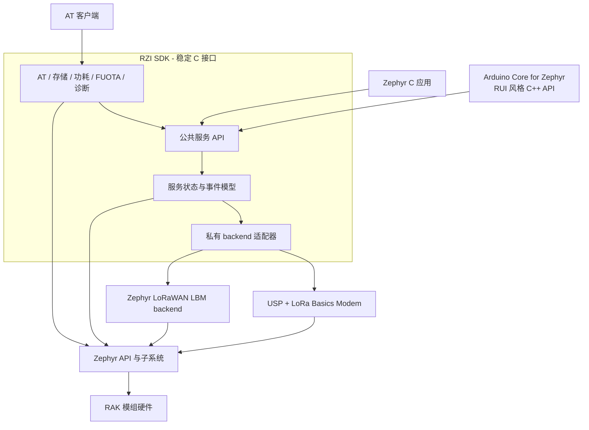
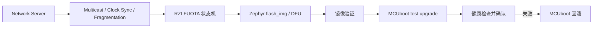

# RZI SDK 总体架构设计

状态：目标架构提案，当前已有 v0.1 基础实现

读者：RZI 维护者、RAK 产品团队、Arduino Core 维护者和应用开发者

主要平台：Zephyr RTOS

首个目标硬件：RAK4631（nRF52840 + SX1262）

## 1. 项目定位

RZI 是 RAK 产品基于 Zephyr 开发时使用的稳定 C SDK 层。它向应用提供符合
RAK 使用习惯的连接和设备服务接口，同时隐藏实际使用的协议栈、协议引擎、
调度机制和私有数据类型。

RZI 是一个独立 Git 仓库，也是标准的 Zephyr module。客户应用通过 west
引用 RZI。Arduino Core for Zephyr 位于另一个仓库，在 RZI 公共 C API 上实现
RUI 风格的 C++ API。

RZI 有四个主要目标：

1. Zephyr 和底层协议栈升级时，保持客户应用 API 稳定。
2. 在支持的 RAK 模组和不同后端上提供一致的行为。
3. 复用 Zephyr 的硬件描述、存储、功耗、升级、日志和测试机制。
4. 允许客户只选择产品需要的服务，避免引入不使用的功能。

RZI 不应成为 Zephyr distribution、Zephyr board fork 或另一份 LoRa Basics
Modem。RZI 不复制 Zephyr 驱动，也不把 Semtech 或其他 backend 的类型暴露给
客户应用。

## 2. 仓库与工作区模型

推荐使用 application-as-manifest 的 west 工作区：

```text
rzi-workspace/
├── .west/
├── app/                    客户应用和 west manifest
├── rzi/                    独立 RZI SDK 仓库
├── zephyr/                 应用选择的 Zephyr 版本
├── usp_zephyr/             当前 USP backend 依赖
└── modules/lib/usp/        当前 USP 实现依赖
```

客户应用只需要在 `west.yml` 中声明 RZI：

```yaml
manifest:
  projects:
    - name: rzi
      url: https://github.com/DanielCao0/RZI
      revision: <validated-rzi-tag-or-sha>
      path: rzi
      import: true
```

用户执行 `west update` 后，west 会拉取 RZI 以及当前默认 backend 所需的
依赖。Zephyr 的版本由客户应用选择。正式产品必须固定 RZI release tag 或
commit SHA，不应长期跟随 `main`。

RZI 仓库只保存可复用 SDK 代码和用于验证 SDK 能力的精简 sample。大量完整
应用示例可以放在独立的 RZI Example 仓库。具体产品业务不进入 RZI 仓库。

## 3. 系统总体分层



RZI 公共 C API 是兼容性边界。底层变化应停留在私有 backend adapter 内。
AT 组件和 Arduino C++ 层都是 RZI 公共 API 的客户，不允许直接调用 backend。

## 4. 各层职责

| 层 | 主要职责 | 是否属于应用接口 |
|---|---|---|
| 客户应用 | 产品行为、凭据配置、发送周期、用户界面 | 不适用 |
| Arduino/RUI C++ | RUI 风格对象、重载、回调和 Arduino 兼容 | 是，独立仓库 |
| RZI 公共服务 | 稳定语义、参数检查、状态和事件 | 是，纯 C ABI |
| RZI backend | 把 RZI 操作映射到一种底层实现 | 否 |
| 协议栈 | LoRaWAN MAC、区域、ADR、RX 窗口和加密 | 否 |
| Zephyr | 内核、驱动、DTS、settings、PM 和 DFU | Zephyr 接口 |
| RAK 硬件 | MCU、Radio、RF switch、TCXO 和 Flash | 由上游 DTS 描述 |

一个固件镜像只编译一个 LoRaWAN backend。不能让两个协议后端在运行时同时
控制同一个 SX1262 设备。

### 4.1 RZI 负责

- 公共 API 的名称、参数、返回值和事件语义；
- 服务生命周期和应用可见状态；
- backend capabilities 和功能检查；
- RAK/RUI3 兼容的 AT 命令行为；
- RZI 配置数据格式、版本和迁移；
- 产品级功耗协调；
- FUOTA 状态和产品接口；
- 设备启动契约（`CONFIG_RZI_MCUBOOT`、产品板、合并镜像）；
- 支持版本、模组、区域和功能矩阵。

### 4.2 Backend 负责

- 协议栈初始化和 engine 调度；
- region、join、uplink、downlink、状态和事件映射；
- 底层协议栈需要的锁和串行化；
- LoRaWAN session、frame counter、DevNonce 和 ADR context；
- 把底层错误、RSSI/SNR 等信息转换为 RZI 类型。

### 4.3 Zephyr、上游 BSP 和 MCUBoot 负责

- SoC、驱动和上游 `rak4631` / `rak3172` 硬件参考描述；
- GPIO、SPI、Flash、UART、entropy、timer 和 PM 驱动；
- settings、NVS、flash map；
- MCUBoot **源码**（west 模块）以及验签、选槽、跳应用；
- 已经合并并稳定的上游协议 API。

RZI 导出产品 `board_root`（`rzi_rak4631`、`rzi_rak3372`）和用于分区 dtsi 的
`dts_root`。不 fork SoC 描述。客户入口是 RZI 产品板，不是上游板名。
MCUBoot 契约见 [boot.md](./boot.md)：`CONFIG_RZI_MCUBOOT`、sysbuild、合并镜像。

### 4.4 客户应用负责

- 产品策略和业务逻辑；
- 凭据写入、安全和访问控制；
- 选哪块 RZI 产品板、哪个 backend、何时 join / send / sleep / update / reboot；
- 不要自己配 Zephyr 分区或 `SB_CONFIG_*`（官方例程已经带好）。

## 5. 公共 API 设计原则

所有应用接口都放在 `include/rzi/`，提供带 C++ guard 的 C ABI。公共头文件
只使用 RZI 类型、标准 C 类型，以及 I/O adapter 边界无法避免的稳定 Zephyr
类型。

公共 API 必须遵守：

- 成功返回 `0`，失败返回负 errno；
- 进入 backend 前完成公共参数检查；
- 不暴露 USP、LBM 或 backend 私有类型；
- 异步请求必须复制数据，或明确规定数据生命周期；
- 异步完成结果通过正式事件报告；
- 基础配置不使用动态堆；
- 同一个 RZI major version 内保持源码兼容。

RZI 不需要一对一包装 Zephyr 或 USP 的所有 API。只有形成 RAK 产品能力的
功能才进入公共接口。

目标公共头文件结构：

```text
include/rzi/
├── version.h              SDK 版本和兼容性查询
├── capabilities.h         服务和 backend 能力查询
├── lorawan.h              与 backend 无关的 LoRaWAN API
├── at.h                   AT 生命周期和 I/O 绑定
├── storage.h              有版本的 RZI 配置存储
├── power.h                睡眠限制与唤醒策略
├── fuota.h                升级状态和控制
└── diagnostics.h          稳定诊断数据
```

当前代码里还不存在的头文件只是目标规划，不代表已经承诺或实现了对应 API。

## 6. LoRaWAN 服务

### 6.1 当前 v0.1 已实现

当前 `include/rzi/lorawan.h` 包含：

- 使用 region 和 OTAA 凭据初始化；
- OTAA join 和 leave；
- confirmed/unconfirmed uplink；
- joined 状态查询；
- READY、JOINED、JOIN_FAILED、TX_DONE、DOWNLINK 和 ERROR 事件；
- 单 modem、单事件消费者和单个未完成 uplink；
- 固定容量事件队列和 overflow 报告。

`src/lorawan/lorawan.c` 负责公共参数检查和应用事件队列。
`src/lorawan/backend.h` 是私有 backend contract，由
`src/lorawan/backends/` 下选中的一个实现提供。

### 6.2 Capabilities 模型

不同 backend 的能力不会始终相同。增加更多可选 LoRaWAN API 之前，应先提供
capability bitset，例如：

```text
OTAA, ABP, CLASS_B, CLASS_C, ADR_CONTROL, CHANNEL_MASK,
LINK_CHECK, DEVICE_TIME, MULTICAST, FUOTA, CSMA, RELAY
```

当前 backend 不支持的可选操作统一返回 `-ENOTSUP`。AT 和 C++ 层根据
capabilities 判断功能，不能根据 backend 名称猜测。

### 6.3 并发和事件

Backend callback 只完成最小工作，然后复制并发布 RZI event。产品业务必须
在应用线程执行。Backend 持有协议栈 mutex 时不能调用任意用户代码。

当前单消费者 queue 足够支持 v0.1。未来 AT、FUOTA 和客户应用需要同时处理
事件时，必须先引入统一 event dispatcher 或定义独立的内部 service hook。
多个消费者不能同时从一个破坏性 queue 中读取，否则会相互抢走事件。

## 7. Backend 策略

### 7.1 USP backend

状态：已经实现，目前默认使用。

USP backend 负责初始化 USP/RAC/LBM、串行化 modem API、转换 modem event，
并通过 USP HAL 保存当前 LoRaWAN context。

对于高级 USP/RAC 功能、更多 radio 类型，以及 Zephyr 上游尚未支持的能力，
USP backend 仍然有价值。

### 7.2 Zephyr LBM backend

状态：有条件的后续规划。

Zephyr `main` 已经自动拉取 LoRa Basics Modem，并把它用于基础 LoRa radio
API。上游 PR
[`#117833`](https://github.com/zephyrproject-rtos/zephyr/pull/117833) 正在增加
基于 LBM 的 Zephyr LoRaWAN backend，而且已经使用 RAK4631 做过硬件验证。
这个 PR 目前还不是正式发布的 Zephyr 接口。

RZI 可以增加 `src/lorawan/backends/zephyr_lbm.c` 作为实验 backend。满足以下
条件后才能把它改为默认 backend：

1. PR 已合并，并进入 RZI 支持的正式 Zephyr release；
2. RAK4631 的 OTAA、上下行、RX1/RX2、ADR、重启恢复和区域测试全部通过；
3. 上游 backend 的错误和事件能够满足 RZI contract；
4. 产品功能不需要绕过 Zephyr API 直接调用 LBM 私有接口。

当前上游方案支持 OTAA 和 Class A，但 ABP、Class B/C、Device Time、channel
mask 和一些 modem 控制还不完整。在需要的能力达到要求前，RZI 保留 USP
backend。

### 7.3 Zephyr LoRaWAN API backend

状态：已实现，用于检验 RZI 合同，不是默认 backend。

`CONFIG_RZI_LORAWAN_BACKEND_ZEPHYR` 适配 Zephyr 公共
`<zephyr/lorawan/lorawan.h>`，下层固定为 loramac-node。它和规划中的
Zephyr LBM backend 不是同一条路径。合同评估见
`doc/lorawan-backend-zephyr.md`。

### 7.4 Backend 选择

Backend 使用 Kconfig `choice` 在编译期选择：

```text
CONFIG_RZI_LORAWAN_BACKEND_USP
CONFIG_RZI_LORAWAN_BACKEND_ZEPHYR
CONFIG_RZI_LORAWAN_BACKEND_ZEPHYR_LBM       规划中
```

Common layer 不写针对具体 backend API 的条件分支。CMake 只编译一个 adapter，
每个 adapter 都实现相同的私有 operations table。具体 west 命令、overlay
和互斥项见 `doc/lorawan-backends.md`。

## 8. 依赖和版本策略

Kconfig 无法决定 west 下载哪些仓库，因为 `west update` 发生在应用 Kconfig
配置之前。因此依赖策略分成三个阶段。

### 8.1 当前 USP 默认阶段

RZI 根目录 `west.yml` 固定 `usp_zephyr` 和 `usp` 的 commit SHA。客户只需
import RZI 并执行 `west update`。

### 8.2 Zephyr LBM 验证阶段

验证应用可以在 import 时 blocklist USP 项目，并选择包含上游 LBM backend
的 Zephyr commit。这条路径只用于 CI 和硬件验证，不作为正式产品依赖。

### 8.3 Zephyr LBM 默认阶段

上游迁移条件全部满足后，RZI 默认 backend 改为 Zephyr LBM，根 manifest 不再
默认下载 USP。需要 USP 高级能力的产品显式 import 单独的 USP manifest
fragment。

每个 RZI release 必须记录：

- 支持的 Zephyr release 和 commit 范围；
- 默认和可选 backend 版本；
- 支持的 board、region 和 capability；
- bootloader 和 flash layout 要求。

Release manifest 必须使用 tag 或不可变 SHA，不能依赖未合并 PR 的 head。

## 9. AT 组件

状态：已经实现 I/O 无关的命令框架和基础 RUI3 LoRaWAN 命令包。

AT 是 RZI 公共服务的客户。AT 组件不能直接调用 `smtc_modem_*`、Zephyr
LoRaWAN API 或 backend 私有 API。

当前实现已经把协议处理、命令包和 I/O 拆分：

```text
src/at/
├── core.c                   生命周期、RX queue、执行线程和输出
├── parser.c                 RUI3 行语法和行编辑
├── registry.c               命令注册和查找
├── commands/
│   ├── system.c
│   ├── lorawan.c
│   ├── power.c
│   └── fuota.c
└── adapters/
    ├── uart.c                  已实现
    └── ble_uart.c              基于 RUI3 SERIAL_BLE0 的占位
```

adapter 只负责 AT Core 与具体 I/O API 之间的字节收发，不允许绕过 parser
向 modem 透明转发。USB CDC ACM 作为 Zephyr UART 设备时继续使用 UART
adapter；BLE UART 占位只有在 Zephyr GATT contract 明确后才实现。每条
RUI3 兼容命令都应记录 syntax、response、异步事件、持久化、reset 行为和
不支持的参数。

`CONFIG_RZI_AT` 不依赖 LoRaWAN 或 UART。`CONFIG_RZI_AT_COMMAND_LORAWAN`
等命令包只依赖它所代理的 RZI service，`CONFIG_RZI_AT_ADAPTER_UART` 等
adapter 独立选择。应用可以在调用 `rzi_at_start()` 前注册静态生命周期的
自定义命令。

## 10. 配置和 NVM

持久化数据必须分清所有者：

| 数据 | 所有者 | 示例 |
|---|---|---|
| 产品/RZI 配置 | RZI storage | region、join mode、power policy |
| 密钥 | provisioning/security 层 | DevEUI、JoinEUI、AppKey/NwkKey |
| LoRaWAN context | Backend | frame counter、DevNonce、session、ADR |
| 升级状态 | RZI FUOTA | 下载进度、镜像版本、待确认状态 |

当前 AT 组件直接使用 Zephyr settings/NVS 保存基础参数。目标 storage service
统一处理 schema version、默认值、合法性、迁移、factory reset 和原子更新。

建议的 settings namespace：

```text
rzi/meta/*
rzi/config/*
rzi/at/*
rzi/fuota/*
```

Backend 的 opaque protocol context 由 backend 自己管理，RZI 不复制或修改。
正式产品凭据不编译进 DTS、不写日志，也不通过 diagnostics 返回。Sample
overlay 只能用全零凭据作为编译占位。

## 11. 功耗管理

状态：规划中。

RZI power service 负责协调产品睡眠策略，实际 device/system power transition 由
Zephyr 完成。各服务向 power coordinator 报告：

- 是否有操作正在执行；
- 下一次必须唤醒的时间；
- 是否有 LoRaWAN RX window；
- 是否正在写 Flash 或升级；
- UART/USB 活动是否阻止深度睡眠；
- 产品需要保留哪些 wake source。

协议时序仍由 backend 负责。应用层 RZI power service 不自己计算或推迟 RX1/RX2
窗口。

功耗验收包括 idle current、joined sleep current、RX window timing、wake
latency、配置保持，以及反复 sleep/join/send 的稳定性。

## 12. FUOTA

状态：协调 API 已实现；MCUboot 产品安装路径仍为可选项。



RZI 负责升级状态机和公共事件；LoRaWAN backend 负责它支持的 multicast、clock
sync 和 fragmentation package；Zephyr 负责 Flash 和 reboot 集成；MCUboot
负责签名验证、test boot、confirm 和 rollback。

只有 backend 上报所需 capabilities 后才能启用 FUOTA。正式产品必须使用签名
镜像并支持失败回滚。

## 13. Arduino Core 和 RUI C++

Arduino Core for Zephyr 是 RZI 的独立上层客户：

```text
Arduino sketch
    -> RUI 风格 C++ 类
        -> extern "C" RZI API
            -> 选中的 backend
```

C++ 层负责 Arduino 对象、重载、callback 和 sketch 兼容，不包含协议栈集成，
也不 include RZI 私有头文件。这样 Zephyr C 应用、AT 固件和 Arduino 应用能够
共享同一个 RZI C 实现。

状态：ArduinoCore-zephyr `cores/arduino/RUI.*` 已提供 `api.lorawan` OTAA
子集（join / send / band / njm / callback）。ADR、P2P 和完整 RUI3 系统 API
仍未接。Sketch 禁止 include USP。

## 14. Diagnostics

状态：规划中。

Diagnostics 应提供稳定的产品数据：RZI/Zephyr/backend/radio 版本、reset
reason、最后一次错误、join 和 TX 计数、最后一次 RSSI/SNR、queue overflow、
storage 状态、power residency、wake reason 和 FUOTA 状态。

密钥和完整 LoRaWAN session context 永远不能通过 diagnostics 暴露。Backend
日志文本不属于 API contract。

## 15. 目标目录结构

```text
rzi/
├── zephyr/
│   ├── module.yml
│   ├── Kconfig
│   └── CMakeLists.txt
├── include/rzi/
├── src/
│   ├── core/
│   ├── lorawan/
│   │   ├── lorawan.c
│   │   ├── backend.h
│   │   └── backends/
│   │       ├── usp/lorawan_backend_usp.c
│   │       ├── zephyr/lorawan_backend_zephyr.c
│   │       └── zephyr_lbm.c       规划中
│   ├── at/
│   ├── storage/
│   ├── power/
│   ├── fuota/
│   └── diagnostics/
├── samples/
├── tests/
├── doc/
├── scripts/
├── west.yml
├── LICENSE
└── README.md
```

目录在真正增加实现或设计被接受时再创建，不需要提前建立空目录。

## 16. 验证策略

### 16.1 自动验证

- 按支持的 board/backend matrix 构建全部 sample；
- 执行 clang-format 和 Zephyr checkpatch；
- 在 host 或模拟目标测试参数、状态机、queue overflow、AT parser 和配置迁移；
- 每个 backend 独立构建，防止公共层意外 include 私有头文件；
- 使用 C 和 C++ translation unit 分别编译公共头文件；
- 从空目录验证客户 west workspace 依赖解析；
- 扫描非文档源码，确保没有非英文用户界面文本。

### 16.2 硬件验证

每个正式 board/backend/region profile 都要验证：

- cold boot 和 factory reset；
- OTAA join、retry、leave 和 rejoin；
- confirmed/unconfirmed uplink；
- RX1/RX2 downlink 和 RSSI/SNR；
- 重启后的 context 和 frame counter 连续性；
- RF 频率和发射功率；
- 长时间事件和 queue 压力；
- sleep current 和 wake timing；
- 启用 FUOTA 后的正常升级、中断恢复和 rollback。

首个 reference setup 是 RAK4631 加已确认正常的 RAK gateway。构建通过不能
替代射频和功耗实测。

## 17. 开发路线图

| 阶段 | 内容 | 完成条件 |
|---|---|---|
| Stage 0：基础 | Zephyr module、LoRaWAN common、USP backend、基础 AT/NVS 和 sample | 已实现并完成构建验证 |
| Stage 1：接口加固 | SDK version、capabilities、生命周期、错误表和 state/AT 测试 | v0.x contract 完整并有测试 |
| Stage 2：Backend 迁移 | 实验 Zephyr LBM adapter、双 backend CI/硬件矩阵 | 上游正式发布并达到 RAK4631 功能一致 |
| Stage 3：设备服务 | Storage、diagnostics、power、AT 拆分 | 配置迁移和功耗指标通过 |
| Stage 4：FUOTA | LoRaWAN package adapter、DFU 状态机、MCUboot rollback | 签名升级和恢复测试通过 |
| Stage 5：Arduino/RUI | 独立 C++ facade 和兼容测试 | 代表性 RUI 应用不访问 backend 即可运行 |
| Stage 6：稳定版 | 固定依赖、兼容矩阵、迁移指南和 release CI | RZI 1.0 支持策略批准 |

## 18. 当前缺口

| 领域 | 当前状态 | 下一步工作 |
|---|---|---|
| Backend capability | 没有查询 API | 增加可选 LoRaWAN API 前先实现 |
| Event | 单破坏性消费者 | 多服务使用前加入 dispatcher |
| AT | 单个 UART 专用源文件 | 拆分 parser、command 和 adapter |
| 配置存储 | AT 自己管理 settings key | 建立有版本的 RZI storage schema |
| Backend context | USP HAL 管理 | 所有 backend 都保持自己所有权 |
| Zephyr LBM | 上游 PR 尚未合并 | 只验证，不作为 release 依赖 |
| 功耗 | 没有 RZI policy | 定义 blocker、wake contract 和指标 |
| FUOTA | 协调 API 与 USP/LBM 协议包 | 可选 MCUboot apply 路径 |
| C++ RUI | Arduino Core 已有 OTAA facade | ADR / P2P / 完整 system API 仍待导出 |
| API/ABI 版本 | 没有正式规则 | 发布预编译库之前定义 |

每个 milestone 都要重新检查这张表。架构文档必须明确区分已经实现和规划中的
功能。当上游依赖改变职责边界时，要同步更新架构，而不是让旧描述继续存在。
