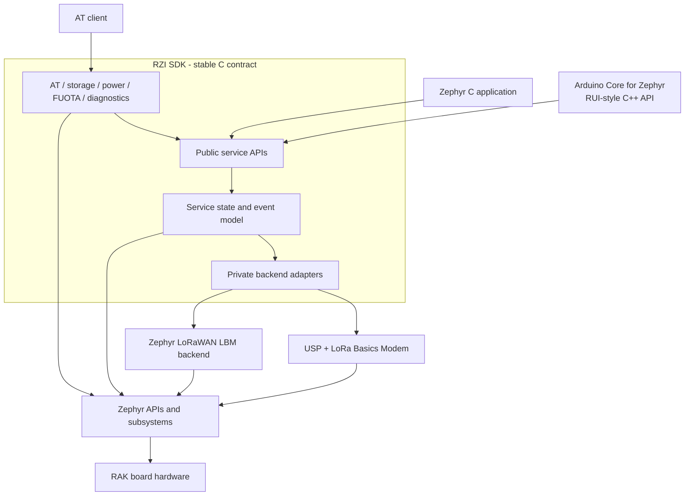
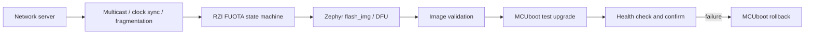

# RZI SDK Architecture

Status: proposed target architecture with an implemented v0.1 foundation

Audience: RZI maintainers, RAK product teams, Arduino Core maintainers, and
application developers

Primary platform: Zephyr RTOS

Initial hardware: RAK4631 (nRF52840 + SX1262)

## 1. Purpose

RZI is the stable C SDK layer for building RAK products on Zephyr. It gives
applications a RAK-oriented interface for connectivity and device services
without exposing the selected protocol stack, its scheduler, or its private
types.

RZI is an independent repository and a standard Zephyr module. A customer
application consumes it as a west project. The Arduino Core for Zephyr is a
separate repository and implements the RUI-style C++ API on top of the public
RZI C API.

RZI has four architectural goals:

1. Keep the application API stable while Zephyr and protocol backends evolve.
2. Provide consistent RAK behavior across supported boards and backends.
3. Reuse Zephyr facilities for hardware description, storage, power
   management, device firmware update, logging, and testing.
4. Let customers select only the services required by their product.

RZI is not a Zephyr distribution, a board fork, or another copy of LoRa Basics
Modem. It does not replace Zephyr drivers and does not expose Semtech or backend
headers as part of its public contract.

## 2. Repository and workspace model

The supported customer topology is an application-as-manifest west workspace:

```text
rzi-workspace/
├── .west/
├── app/                    Customer manifest repository
├── rzi/                    Independent RZI SDK repository
├── zephyr/                 Revision selected by the application
├── usp_zephyr/             Current USP backend dependency
└── modules/lib/usp/        Current USP implementation dependency
```

The application declares RZI and imports its dependency manifest:

```yaml
manifest:
  projects:
    - name: rzi
      url: https://github.com/DanielCao0/RZI
      revision: <validated-rzi-tag-or-sha>
      path: rzi
      import: true
```

`west update` fetches RZI and the dependencies required by the default backend.
The application selects its Zephyr revision. Production applications shall pin
RZI to a released tag or commit instead of following `main`.

The RZI repository contains reusable library code and focused verification
samples. A separate example repository may contain a larger catalog of
complete applications. Product code does not belong in the RZI repository.

## 3. System context



The public C API is the compatibility boundary. Backend changes stop at the
private adapter. AT commands and the Arduino C++ wrapper are clients of the
public API and never call a backend directly.

## 4. Responsibility model

| Layer | Responsibility | Application contract |
|---|---|---|
| Application | Product behavior, provisioning, schedule, UI | N/A |
| Arduino/RUI C++ | RUI-style objects, overloads, callbacks | Separate repository |
| RZI services | Stable RAK semantics, validation, state, events | Public C ABI |
| RZI backend | Translate one RZI contract to one implementation | Private |
| Protocol stack | MAC, regions, ADR, RX windows, cryptography | Private |
| Zephyr | Kernel, drivers, DTS, settings, PM, DFU | Zephyr contract |
| Hardware | MCU, radio, RF switch, TCXO, flash | Upstream DTS |

Only one LoRaWAN backend is compiled into a firmware image. Multiple backends
must never control the same radio instance at runtime.

### RZI owns

- public API semantics, validation, errno behavior, and events;
- service lifecycle and application-visible state;
- backend capability reporting and feature gating;
- RAK-compatible AT behavior;
- RZI configuration schema and migrations;
- product-level power coordination and FUOTA state;
- compatibility and hardware validation matrices.

### A backend owns

- protocol-stack initialization and engine execution;
- mapping join, uplink, downlink, status, regions, and events;
- serialization required by the selected stack;
- LoRaWAN session context and frame-counter persistence;
- conversion of backend errors and metadata into RZI types.

### Zephyr and upstream board support own

- board and SoC Devicetree descriptions;
- GPIO, SPI, flash, UART, entropy, timer, and PM drivers;
- settings, NVS, flash map, DFU, and MCUboot integration;
- upstream protocol APIs when they are available and stable.

RZI does not export a `dts_root` while the required board, radio, and bindings
are upstream. Temporary compatibility overlays belong in a sample or
application and need a documented removal condition.

### The application owns

- product policy and business behavior;
- credential provisioning and access control;
- board, RZI version, Zephyr version, and backend selection;
- storage partition and bootloader image layout;
- when to join, send, sleep, update, or reboot.

## 5. Public API rules

Application headers live under `include/rzi/` and provide a C ABI with C++
guards. They contain RZI types, standard C types, and only unavoidable stable
Zephyr types at transport boundaries.

Public APIs:

- return `0` or a negative errno value;
- validate input before entering a backend;
- never expose USP, LBM, or backend-private Zephyr types;
- copy asynchronous request data or define its lifetime explicitly;
- deliver asynchronous completion through documented events;
- avoid heap allocation in the base configuration;
- remain source compatible within a major RZI version.

RZI is not a one-to-one wrapper for every upstream API. A public operation is
added when it represents a supported RAK product capability.

Planned header groups are:

```text
include/rzi/
├── version.h              SDK version and compatibility queries
├── capabilities.h         Service and backend capabilities
├── lorawan.h              Backend-independent LoRaWAN service
├── at.h                   AT lifecycle and transport binding
├── storage.h              Versioned RZI configuration
├── power.h                Sleep constraints and wake policy
├── fuota.h                Update state and control
└── diagnostics.h          Stable counters and health data
```

Headers that do not exist in the current tree are target architecture, not
implemented API commitments.

## 6. LoRaWAN service

### Implemented v0.1 contract

The current `include/rzi/lorawan.h` supports:

- initialization with region and OTAA credentials;
- OTAA join and leave;
- confirmed and unconfirmed uplink requests;
- joined-state query;
- READY, JOINED, JOIN_FAILED, TX_DONE, DOWNLINK, and ERROR events;
- one modem instance, one event consumer, and one outstanding uplink;
- a fixed-size event queue with overflow reporting.

`src/lorawan/lorawan.c` validates requests and owns the application event
queue. The private contract in `src/lorawan/lorawan_backend.h` is implemented
by one source under `src/lorawan/backends/`.

### Target capability model

Backends will not always provide the same features. The common service shall
expose a capability bitset before optional operations are added. Candidate
capabilities are:

```text
OTAA, ABP, CLASS_B, CLASS_C, ADR_CONTROL, CHANNEL_MASK,
LINK_CHECK, DEVICE_TIME, MULTICAST, FUOTA, CSMA, RELAY
```

An unsupported operation returns `-ENOTSUP`. AT and C++ layers query
capabilities instead of inferring support from the backend name.

### Concurrency and events

Backend callbacks perform minimal work and publish copied RZI events. Product
code runs in application context. A backend never calls arbitrary user code
while holding a stack mutex.

The current single-consumer queue is sufficient for v0.1. Before FUOTA, AT,
and an application consume events concurrently, RZI must add a central event
dispatcher or define separate internal service hooks. Multiple clients must
not destructively read the same queue.

## 7. Backend strategy

### USP backend

Status: implemented and current default.

It initializes USP/RAC/LBM, serializes modem calls, maps modem events, and owns
the current LoRaWAN context persistence path. USP remains useful for advanced
USP/RAC features, additional radios, and features absent from upstream Zephyr.

### Zephyr LBM backend

Status: conditional roadmap item.

Zephyr `main` fetches LoRa Basics Modem and supports it for the base LoRa radio
API. Upstream PR
[`#117833`](https://github.com/zephyrproject-rtos/zephyr/pull/117833) proposes an
LBM implementation of the Zephyr LoRaWAN API. It has RAK4631 hardware results,
but is not a released Zephyr contract.

RZI may add `src/lorawan/backends/zephyr_lbm.c` for evaluation. It becomes
eligible as the default only when:

1. the upstream backend is merged and included in a supported Zephyr release;
2. RAK4631 OTAA, uplink, RX1/RX2, ADR, reboot persistence, and regional tests
   pass the RZI hardware matrix;
3. its errors and events can satisfy the RZI contract;
4. production features do not require bypassing Zephyr APIs into LBM internals.

The proposed backend supports OTAA and Class A. ABP, Class B/C, device time,
channel-mask control, and several modem controls remain unavailable. RZI keeps
the USP backend until the required capability matrix is met.

### Selection

Backend selection is a build-time Kconfig `choice`:

```text
CONFIG_RZI_LORAWAN_BACKEND_USP
CONFIG_RZI_LORAWAN_BACKEND_ZEPHYR_LBM       planned
```

The common layer does not contain backend API conditionals. CMake selects one
adapter, and each adapter provides the same private operations table.

## 8. Dependency and version policy

West dependencies cannot be selected by Kconfig because `west update` runs
before application configuration. Dependency management therefore has three
phases.

### Current USP default

The root `west.yml` imports pinned `usp_zephyr` and `usp` revisions. Customers
only import RZI and run `west update`.

### Zephyr LBM evaluation

An evaluation application may blocklist the USP projects and select a Zephyr
revision containing the upstream backend. This is a CI and hardware validation
path, not a production release dependency.

### Future Zephyr LBM default

After the migration criteria pass, the root manifest no longer pulls USP by
default. USP dependencies move to an explicitly imported manifest fragment for
products that require that backend.

Every RZI release records:

- supported Zephyr release and commit range;
- default and optional backend revisions;
- supported boards, regions, and capabilities;
- bootloader and flash-layout constraints.

Release manifests use tags or immutable SHAs and never follow an unmerged PR.

## 9. AT service

Status: transport-independent command framework and basic RUI3-compatible
LoRaWAN command package implemented.

AT is a client of public RZI services. It does not call `smtc_modem_*`, Zephyr
LoRaWAN, or private backend APIs directly.

The implementation separates protocol processing, command packages, and I/O:

```text
src/at/
├── at_core.c                lifecycle, RX queue, execution thread, output
├── at_parser.c              RUI3 line grammar and line editing
├── at_registry.c            command registration
├── at_priv.h                cross-file private contract
├── commands/
│   ├── at_command_system.c
│   ├── at_command_lorawan.c
│   ├── at_command_power.c
│   └── at_command_fuota.c
└── transports/
    └── at_transport_uart.c
```

This permits USB CDC, BLE UART, shell, and test transports without duplicating
command semantics. Compatibility is documented command by command, including
syntax, responses, events, persistence, reset behavior, and unsupported values.

`CONFIG_RZI_AT` does not depend on LoRaWAN or UART. Command packages such as
`CONFIG_RZI_AT_COMMAND_LORAWAN` depend only on the RZI service they expose, and
transports such as `CONFIG_RZI_AT_TRANSPORT_UART` are selected independently.
Applications may register static-lifetime commands before `rzi_at_start()`.

## 10. Configuration and NVM

Persistent state has separate owners:

| State | Owner | Examples |
|---|---|---|
| Product/RZI configuration | RZI storage | region, join mode, power policy |
| Secrets | Provisioning/security layer | DevEUI, JoinEUI, AppKey/NwkKey |
| LoRaWAN protocol context | Backend | frame counters, DevNonce, session, ADR |
| Update state | RZI FUOTA | progress, image version, pending confirmation |

The current AT component persists basic parameters through settings/NVS. The
target storage service centralizes schema versioning, defaults, validation,
migration, factory reset, and atomic updates. Suggested namespaces are:

```text
rzi/meta/*
rzi/config/*
rzi/at/*
rzi/fuota/*
```

RZI does not copy or edit opaque backend context. Production credentials are
not compiled into DTS, logged, or returned by diagnostics. Sample overlays use
zero credentials only as build placeholders.

## 11. Power management

Status: planned.

RZI coordinates product sleep policy; Zephyr performs the power transition.
Services report operation blockers, earliest wake time, RX-window activity,
flash operations, transport activity, and required wake sources.

The backend remains responsible for protocol timing. RZI does not calculate or
delay LoRaWAN RX windows in application code. Acceptance tests cover idle and
joined current, RX timing, wake latency, retained settings, and repeated
sleep/join/send cycles.

## 12. FUOTA

Status: planned architecture.



RZI owns update state and public events. The backend owns supported LoRaWAN
packages. Zephyr owns flash and reboot integration. MCUboot owns signature
verification, test boot, confirmation, and rollback.

FUOTA is enabled only when the backend advertises the required multicast,
clock synchronization, and fragmentation capabilities. Signed images and
rollback are mandatory for a supported product profile.

## 13. Arduino Core and RUI C++

The Arduino Core for Zephyr remains a separate consumer:

```text
Arduino sketch
    -> RUI-style C++ classes
        -> extern "C" RZI API
            -> selected backend
```

The C++ layer owns Arduino object models, overloads, callbacks, and sketch
compatibility. It contains no protocol integration and includes no private RZI
headers. Native Zephyr, AT firmware, and Arduino therefore share one RZI C
implementation.

## 14. Diagnostics

Status: planned.

Diagnostics expose stable product data: component versions, reset reason, last
service error, join and TX counters, last RSSI/SNR, queue overflows, storage
status, power residency, wake reasons, and FUOTA state. Secrets and complete
session context are never exposed. Backend log text is not an API contract.

## 15. Target repository layout

```text
rzi/
├── zephyr/
├── include/rzi/
├── src/
│   ├── core/
│   ├── lorawan/
│   │   ├── lorawan.c
│   │   ├── lorawan_backend.h
│   │   └── backends/
│   │       ├── lorawan_backend_usp.c
│   │       └── lorawan_backend_zephyr_lbm.c       planned
│   ├── at/
│   ├── storage/
│   ├── power/
│   ├── fuota/
│   └── diagnostics/
├── samples/
├── tests/
├── doc/
├── scripts/
├── west.yml
├── LICENSE
└── README.md
```

Directories are added with an implementation or accepted design. Empty
placeholder directories are not required.

## 16. Verification strategy

Automated verification includes:

- build every sample in the supported board/backend matrix;
- run formatting and Zephyr checkpatch;
- test validation, state transitions, queue overflow, AT parsing, and storage
  migration on a host or simulated target;
- compile each backend independently;
- compile public headers from C and C++;
- resolve a clean customer west workspace;
- scan non-documentation source for unintended non-English text.

Hardware verification for each release profile includes cold boot, factory
reset, OTAA, leave/rejoin, confirmed and unconfirmed uplink, RX1/RX2 downlink,
RSSI/SNR, context continuity, RF output, event stress, sleep current, wake
timing, and FUOTA recovery when enabled.

RAK4631 with a known-good RAK gateway is the initial reference setup. A build
pass does not replace RF and power measurements.

## 17. Delivery roadmap

| Stage | Scope | Exit criteria |
|---|---|---|
| 0 - Foundation | Module, common LoRaWAN layer, USP backend, basic AT/NVS, samples | Implemented and build verified |
| 1 - Contract hardening | Version, capabilities, lifecycle, errors, state/AT tests | Public v0.x contract documented and tested |
| 2 - Backend migration | Experimental Zephyr LBM adapter and two-backend matrix | Upstream release and RAK4631 parity |
| 3 - Device services | Storage, diagnostics, power, AT separation | Migration and power targets pass |
| 4 - FUOTA | Package adapter, DFU state, MCUboot rollback | Signed update and recovery pass |
| 5 - Arduino/RUI | Separate C++ facade and compatibility tests | RUI examples run without backend access |
| 6 - Stable release | Versioned manifest, matrix, migration guide, release CI | RZI 1.0 policy approved |

## 18. Current gaps

| Area | Current state | Required work |
|---|---|---|
| Capabilities | No query API | Add before optional LoRaWAN APIs |
| Events | One destructive consumer | Add dispatcher before multiple clients |
| AT | One UART-specific file | Separate parser, commands, transport |
| Configuration | AT owns settings keys | Add versioned RZI storage schema |
| Backend context | USP HAL owns it | Preserve backend ownership |
| Zephyr LBM | Open upstream PR | Evaluate without release dependency |
| Power | No RZI policy | Define blockers, wake contract, targets |
| FUOTA | Not implemented | Define package and MCUboot profile |
| C++ RUI | External future layer | Depend on public C only |
| API/ABI version | No formal policy | Define before prebuilt libraries |

This table is reviewed at each milestone. Architecture documentation must
separate implemented behavior from planned behavior and change when an
upstream dependency moves an ownership boundary.
