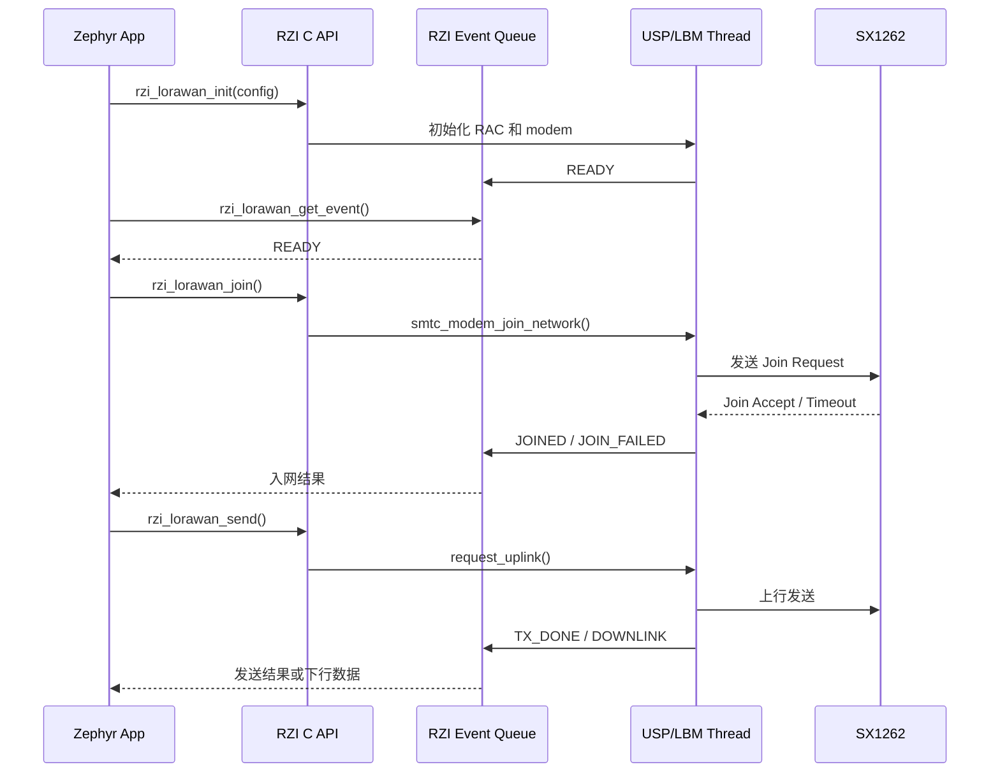

# RZI 与 Zephyr 集成重构变更说明

> 文档版本：v0.1
> 对应目录：`/home/daniel/rzi`
> 目标平台：RAK4631 / nRF52840 / SX1262
> 当前后端：USP + LoRa Basics Modem（LBM）

## 1. 这次修改解决什么问题

修改前，`app/src/main.c` 同时承担以下职责：

- 示例业务：LED、入网重试、定时发送计数器；
- LoRaWAN 服务：初始化 modem、设置密钥和区域、处理 modem 事件；
- USP 并发协调；
- RAK4631 射频开关 GPIO 控制；
- Semtech/LBM 返回值和事件处理。

这种形式可以验证功能，但应用和具体协议栈、具体板卡绑定得很紧。用户如果创建另一个 Zephyr 应用，就必须复制这些初始化代码，并直接理解 USP 和 Semtech API，无法形成可以安装和复用的 RZI SDK。

这次修改把第一块可复用能力提取成 Zephyr module：

```text
用户应用
  └─ RZI 公共 C API
       └─ RZI LoRaWAN 服务
            └─ USP/LBM 私有后端
                 └─ Zephyr 驱动、内核和 RAK4631 硬件描述
```

应用现在只使用 `<rzi/lorawan.h>`。USP、LBM 和板级射频配置由 RZI 管理。这也是以后 Arduino-core/Zephyr 中 C++ RUI API 的 C 语言基础层。

## 2. 改造前后对比

| 项目 | 修改前 | 修改后 |
|---|---|---|
| Zephyr 集成 | 应用手工加入源码和链接定义 | RZI 是标准 Zephyr module |
| LoRaWAN API | 应用直接调用 `smtc_modem_*` | 应用调用 `rzi_lorawan_*` |
| USP 初始化 | 在 `main.c` 中完成 | RZI USP backend 负责 |
| modem 回调 | 回调中直接执行应用逻辑 | 回调复制事件到 Zephyr message queue |
| 并发 | 应用需要理解 USP 线程行为 | RZI 使用 `rac_api_mutex` 串行化调用 |
| 射频开关 | `main.c` 手工配置 P1.05/P1.07 | RZI 板级 DTS 使用 GPIO hog |
| REGOUT0 3.3 V | `app/src/board.c` | `src/boards/rak4631.c` |
| SX1262 配置 | 应用 overlay 内包含完整配置 | RZI 提供可复用 `rak4631.dtsi` |
| 功能选择 | 应用直接选择一组 USP 配置 | `CONFIG_RZI` / `CONFIG_RZI_LORAWAN` |
| C++ RUI 接入 | 需要直接依赖 Semtech API | 将来包装稳定的 RZI C API |

## 3. 新的代码结构

```text
rzi/
├── zephyr/                            # module.yml、Kconfig 和 CMake
├── include/rzi/                       # 对应用公开的 C ABI
├── src/                               # LoRaWAN 私有后端和板级兼容代码
├── dts/rzi/boards/                    # 可复用 RAK4631 Devicetree profile
├── samples/lorawan/class_a/           # 最小 Class A 标准 sample
├── doc/                               # 内部中文架构文档
├── LICENSE
└── README.md
```

客户应用是 `/home/daniel/rzi-workspace/app`，它拥有 `west.yml`、业务源码、
凭据、构建脚本和补丁。RZI 是它在 west manifest 中引用的平级项目。

## 4. RZI 如何接入 Zephyr

### 4.1 Zephyr module 描述

`zephyr/module.yml` 声明：

- 模块名称为 `rzi`；
- CMake/Kconfig 使用 Zephyr 默认入口 `zephyr/CMakeLists.txt` 和 `zephyr/Kconfig`；
- DTS root 是模块根目录；
- 模块依赖 `usp_zephyr`；
- Twister sample root 是模块内的 `samples/`。

客户 `app/west.yml` 把 RZI 声明为独立 west project。`west update` 后，Zephyr
通过 RZI 的 `zephyr/module.yml` 自动发现模块。客户应用的 CMake 不需要设置
`EXTRA_ZEPHYR_MODULES`，也不需要知道 RZI 在磁盘上的相对路径。

### 4.2 Kconfig 职责

应用现在只选择：

```ini
CONFIG_RZI=y
CONFIG_RZI_LORAWAN=y
```

`RZI_LORAWAN` 自动选择当前后端需要的：

- `LORA_BASICS_MODEM_DRIVERS`
- `USP`
- `USP_LORA_BASICS_MODEM`
- `USP_MAIN_THREAD`
- `USP_THREADS_MUTEXES`

`CONFIG_RZI_RAK4631_LEGACY_REGOUT` 默认在 RAK4631 LoRaWAN 场景启用，用于全擦除后把 nRF52840 `REGOUT0` 设置为 3.3 V。未来官方 WisBlock BSP 自己提供同等处理时，可以关闭这个兼容选项，避免两个 `board_early_init_hook` 冲突。

### 4.3 CMake 职责

`zephyr/CMakeLists.txt` 完成三件事：

1. 把 `include/` 暴露为公共头文件路径；
2. 根据 Kconfig 编译 USP backend 和 RAK4631 板级代码；
3. 把私有实现链接到 `lbm_compile_definitions`，应用不再直接处理 SX1262/LBM 编译定义。

## 5. 新增的 LoRaWAN 公共 C API

公共接口位于 `include/rzi/lorawan.h`：

```c
int rzi_lorawan_init(const struct rzi_lorawan_config *config);
int rzi_lorawan_join(void);
int rzi_lorawan_leave(void);
int rzi_lorawan_send(uint8_t port, const uint8_t *data,
                     size_t size, bool confirmed);
int rzi_lorawan_is_joined(bool *joined);
int rzi_lorawan_get_event(struct rzi_lorawan_event *event,
                          int32_t timeout_ms);
```

API 使用纯 C ABI，并带 `extern "C"` 保护，因此未来 Arduino-core/Zephyr 的 C++ RUI 层可以直接包装它，而不用包含 Semtech 头文件。

初始化配置包含：

- LoRaWAN region；
- DevEUI；
- JoinEUI；
- Network root key；
- Application root key；
- 仅用于开发调试的 join backoff bypass。

公共事件包括：

- `RZI_LORAWAN_READY`
- `RZI_LORAWAN_JOINED`
- `RZI_LORAWAN_JOIN_FAILED`
- `RZI_LORAWAN_TX_DONE`
- `RZI_LORAWAN_DOWNLINK`
- `RZI_LORAWAN_ERROR`

下行事件会携带 port、payload、RSSI 和 SNR。LBM 的 RSSI 偏移表示会在 RZI 内转换为 dBm；SNR 明确保留为四分之一 dB 单位 `snr_quarter_db`。

## 6. 运行时调用流程



RZI 初始化时复制配置，因此调用者不需要永久保存配置对象。modem 发出 RESET 事件后，RZI 设置密钥和区域，然后发布 READY。应用收到 READY 后才允许 join/send。

## 7. 为什么使用消息队列

USP engine 的 modem callback 在协议栈执行环境中发生。如果直接在 callback 中运行用户代码，用户的日志、存储或其他阻塞操作可能长时间占用协议栈锁，影响接收窗口和时间敏感操作。

现在 callback 只完成以下工作：

1. 读取 Semtech event；
2. 转换为 RZI event；
3. 复制到固定容量的 Zephyr `k_msgq`；
4. 立即返回。

应用在自己的线程中调用 `rzi_lorawan_get_event()`。这样应用事件处理与 USP engine 隔离。队列默认深度为 8，可以通过 `CONFIG_RZI_LORAWAN_EVENT_QUEUE_SIZE` 调整。队列满时返回一次 `-EOVERFLOW`，不会静默丢失而不报告。

当前 v0.1 的约束是：

- 一个 modem 实例；
- 一个 LoRaWAN stack，ID 为 0；
- 一个事件消费者；
- 同时只允许一个未完成 TX；
- 初始化每次启动只能执行一次；
- 不支持运行时 teardown/reinit。

这些限制被写入公共接口契约，后续增加多实例、请求 ID 或多个订阅者时再扩展，而不是现在提供空实现。

## 8. USP 并发和错误处理

所有会进入 Semtech modem 的公共调用都使用 USP 提供的递归 `rac_api_mutex`，与 USP engine 串行化。调用结束、释放锁以后执行 `smtc_modem_hal_wake_up()`，使 engine 及时处理新请求。

Semtech 返回码在 backend 内转换成 Zephyr 常见的负 errno：

| RZI 返回值 | 含义 |
|---|---|
| `0` | 请求已接受；对 send 来说不代表已经发射成功 |
| `-EINVAL` | 参数、区域、端口或 payload 不合法 |
| `-EAGAIN` | 尚未初始化完成、没有事件或暂时没有执行条件 |
| `-EBUSY` | modem 忙或已有一个 TX 未完成 |
| `-EALREADY` | 重复初始化 |
| `-EWOULDBLOCK` | 从 ISR 调用了仅允许在线程中使用的 API |
| `-EOVERFLOW` | 事件消费者太慢，队列发生过溢出 |
| `-EIO` | 未细分的 backend 错误 |

## 9. 与信号问题有关的板级修改

之前 RSSI 约为 -100 dBm、SNR 约为 -20 dB，而同一网关上的其他节点正常，因此重点检查了节点射频路径。RZI 的 RAK4631 profile 现在固定以下配置：

- 使用 `semtech,sx1262-new`；
- 编译 SX1262 backend 时带 `-DSX1262 -DSX126X`；
- DIO2 控制 RF switch；
- DIO3 控制 3.3 V TCXO；
- SX1262 使用 DCDC regulator mode；
- P1.05 配置为 output-high，为射频开关供电；
- P1.07 配置为 input，避免 MCU GPIO 与 SX1262 DIO2 争用；
- 全擦除后把 nRF52840 VDDH REGOUT0 设置为 3.3 V。

这些内容从示例应用移动到 `dts/rzi/boards/rak4631.dtsi` 和 `src/boards/rak4631.c`，因此以后每个 RZI 应用都能使用同一份正确板级配置。发送前不再反复重新配置 P1.05，避免 TX 瞬间射频开关短暂掉电。

这次构建验证证明配置已进入最终固件，但仍需要烧录后做近距离 RSSI/SNR、Join、上行 ACK、下行窗口和功耗测试，才能确认实际射频性能。

## 10. 示例应用改了什么

`app/src/main.c` 从 291 行缩减到 146 行，保留原来的可观察行为：

- 入网前绿灯闪烁；
- 入网后绿灯常亮；
- 每次发送蓝灯短闪；
- USB console 最多等待 10 秒；
- 每 5 秒发送一个 4 字节 confirmed counter；
- Join 失败后等待 5 秒重试；
- 当前示例继续启用开发用 join backoff bypass。

应用删除了：

- 所有 `smtc_modem_*` 调用；
- USP/RAC 初始化；
- modem callback；
- 应用内射频 GPIO 配置；
- Semtech/USP 私有头文件；
- 对 `lbm_compile_definitions` 的直接链接。

应用现在只负责业务状态机，LoRaWAN 生命周期由 RZI API 和事件驱动。

## 11. 已完成的构建验证

使用 RAK4631/nRF52840 做了新的干净构建，结果通过：

```text
Board: rak4631/nrf52840
FLASH: 178456 B / 1 MB   (17.02%)
RAM:    50776 B / 256 KB (19.37%)
```

模块自带的 `samples/lorawan/class_a` 也独立构建通过：

```text
Board: rak4631/nrf52840
FLASH: 153652 B / 1 MB   (14.65%)
RAM:    40928 B / 256 KB (15.61%)
```

还核对了以下生成结果：

- RZI 和 USP 分别编译成 Zephyr library 并链接；
- `CONFIG_RZI=y`、`CONFIG_RZI_LORAWAN=y`；
- `CONFIG_USP_THREADS_MUTEXES=y`；
- SX1262 源文件带 `-DSX1262 -DSX126X`；
- 最终 DTS 包含 DIO2 RF switch、DIO3 TCXO、3.3 V、DCDC；
- 最终 DTS 包含 P1.05 output-high 和 P1.07 input GPIO hog；
- ELF 中存在 RZI LoRaWAN API 和 `board_early_init_hook`；
- `app/src` 不再引用 `smtc_*` 或 USP 头文件；
- `zephyr_module.py` 能发现 RZI CMake/Kconfig、DTS root 和 Twister sample root；
- `west manifest --validate`、YAML 解析和 shell/Python 语法检查通过；
- `git diff --check` 通过。

构建验证目录在验证结束后已删除，没有把生成文件留在 Git 工作区。

## 12. 这次没有实现的内容

当前实现是 RZI SDK 的第一条完整纵向链路，不代表整个 SDK 已完成。以下内容仍属于架构规划：

- AT command framework 和 AT 命令集合；
- 通用配置与 RZI NVM schema；
- 功耗策略、睡眠锁和外设电源管理；
- FUOTA service；
- 安全凭据抽象和 secure element；
- 诊断、统计和统一日志；
- Arduino-core/Zephyr 中的 C++ RUI wrapper；
- 多 modem、多 stack、多事件订阅者；
- 独立 RZI west manifest 和正式版本发布。

目前 LBM 自己管理它已有的持久化数据，本次没有增加一个可能与 LBM 冲突的新 NVM 格式。

## 13. 后续模块如何放置

建议沿用本次形成的边界：

```text
Arduino / RUI C++ API
          │
          ▼
RZI public C APIs
  ├── lorawan
  ├── at
  ├── nvm/config
  ├── power
  ├── fuota
  └── diagnostics
          │
          ▼
RZI internal services and backend interfaces
          │
          ▼
USP/LBM, Zephyr subsystems, MCU drivers, board DTS/BSP
```

当增加第二个 LoRaWAN backend 时，再在 `backends/` 上方引入内部 backend vtable。当前只有 USP 一个实现，直接实现 service API 更简单，也避免为了架构图增加没有实际价值的空层。

AT 和 C++ RUI 层应当作为 RZI C API 的消费者。这样同一个 LoRaWAN 状态、事件和 NVM 所有权只有一份，不会出现 AT、C++ API、用户应用分别直接控制 modem 的冲突。

## 14. Zephyr 标准化整改依据

第二轮整改对照 Zephyr 官方 Modules 文档和官方 `example-application`：

- `zephyr/module.yml` 位于待发布模块根目录下；
- 使用默认的 `zephyr/CMakeLists.txt` 和 `zephyr/Kconfig` 集成入口；
- 在 `module.yml` 中固定模块名并声明 `usp_zephyr` 依赖；
- 公共头文件使用模块名前缀 `include/rzi/`；
- DTS root 指向模块根，并保持 `<dts_root>/dts` 目录结构；
- sample 放在模块内，提供 `sample.yaml`、`README.rst`、应用 CMake、配置、
  overlay 和源码；
- `module.yml` 声明 `samples/`，供 Zephyr module/Twister 工具发现；
- 模块根包含 Apache-2.0 LICENSE，各源码和构建元数据带 SPDX 标识。

RZI 仓库与客户应用已经分离。`/home/daniel/rzi` 是可直接发布的 module 仓库；
`/home/daniel/rzi-workspace/app` 是客户视角的 manifest repository。workspace
同时包含 `rzi`、`zephyr`、`usp_zephyr` 和 USP 等独立 west projects。

官方参考：

- <https://docs.zephyrproject.org/latest/develop/modules.html>
- <https://github.com/zephyrproject-rtos/example-application>

## 15. 面向国际用户的语言规范

`doc/` 用于内部设计和代码导读，可以保留中文。其余由本项目维护的文件统一使用
英文，包括源码注释、Kconfig/CMake、DTS overlay、west manifest、补丁元数据、
Docker/烧录脚本、命令帮助和 README。补丁清单生成器的模板也已改为英文，防止
重新生成 `patches.yml` 时恢复中文。

验证使用 Git 已跟踪文件和未忽略新增文件作为输入，并排除 `doc/`；Unicode Han
字符扫描结果为零。west 下载的 Zephyr、USP 等第三方仓库不属于 RZI 自有源码，
也不在此次语言整改范围内。

## 16. 最终目录迁移

- 删除临时 `sdk/rzi/` 包装层，模块内容提升到仓库根；
- RZI 仓库只保留模块代码、公共头文件、DTS、sample 和架构文档；
- 客户应用成为 `/home/daniel/rzi-workspace/app` 独立 Git 仓库；
- `app/west.yml` 明确引用独立 RZI project；
- 应用业务、凭据、Docker、烧录工具和临时 west patches 归客户应用维护；
- RZI 保留最小 API 示例 `samples/lorawan/class_a/`；
- 真实 OTAA 凭据从应用示例移除，公开文件只保留零值占位符；
- Zephyr、USP 等第三方 checkout 只存在于外层 workspace。

这些改动目前保留在工作区中，尚未创建 Git commit。
