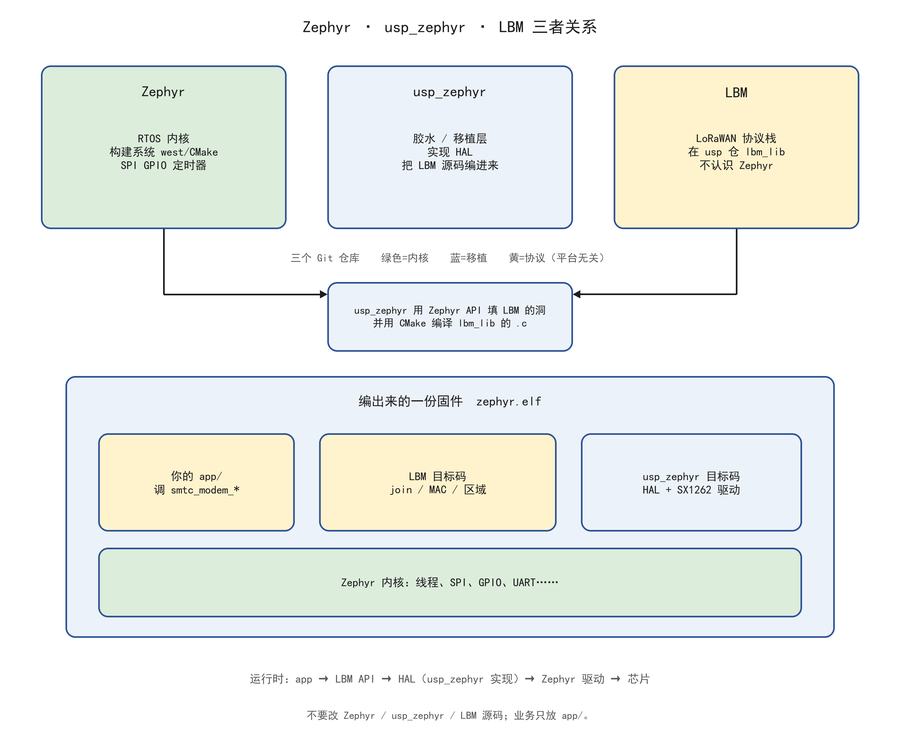
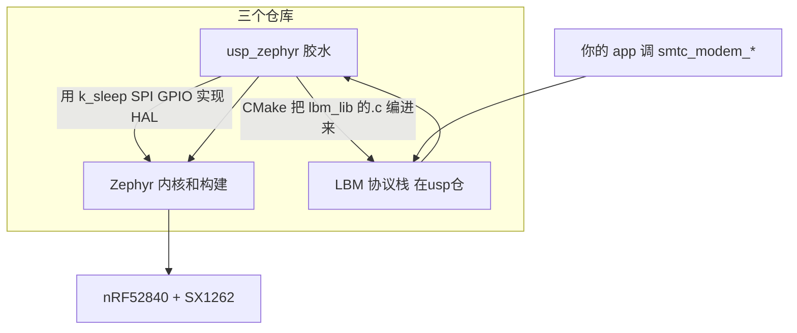

# Zephyr、usp_zephyr、LBM 三者关系

> USP 路径说明：本文描述当前 RZI 的 USP backend。Zephyr `main` 已经拉取
> LoRa Basics Modem，并正在通过上游 PR 增加 LoRaWAN backend。RZI 的迁移
> 条件和长期分层以 [RZI SDK Architecture](./rzi-sdk-architecture.md) 为准。

三个不同的 Git 仓库，编进**同一份**固件。业务只写在你的 `app/`。

打开本文件请用 Markdown 预览（`Ctrl+Shift+V`）。

分层调用（应用 → LBM → RAC → HAL → 芯片）见 [usp_zephyr 架构图](./usp-zephyr-architecture.png)，说明见 [usp_zephyr 框架](./usp_zephyr-framework.md) §2。





## 各管什么

| | 是什么 | 认不认识另外两个 | 你改不改 |
|--|--|--|--|
| **Zephyr** | RTOS：线程、SPI、GPIO、UART、west/CMake | 不知道 LBM | 不改 |
| **LBM** | LoRaWAN 状态机（join、MAC、区域） | 不知道 Zephyr，只认 `smtc_modem_hal_*` | 不改 |
| **usp_zephyr** | 中间的胶水 | 两边都认识 | 不改（RAK 板用 overlay，仍放 `app/`） |

LBM 源码在 `modules/lib/usp/protocols/lbm_lib/`，**不在** `usp_zephyr` 目录里，也不在 `zephyr/` 里。

## 怎么接上的

1. **构建**：`usp_zephyr/modules/usp/CMakeLists.txt` 在 `CONFIG_USP_LORA_BASICS_MODEM=y` 时，把 LBM 的 `.c` 加进 Zephyr 的 library，同时编译 `smtc_modem_hal.c`。
2. **运行**：你调 `smtc_modem_request_uplink()` → LBM 组 LoRaWAN 帧 → 经 RAC 预约射频 → usp_zephyr 用 Zephyr 的 SPI 去写 SX1262。LBM 要「现在几点、存 NVM」时，调用 HAL，实现是 usp_zephyr 里对 `k_uptime` / flash 的封装。

```text
app          要发一包
  → LBM      组 Join / MAC 帧
    → RAC    排队用电台
      → usp_zephyr 驱动
        → Zephyr SPI/GPIO
          → 芯片
```

## 和「Zephyr 自带 LoRaWAN」不要混

Zephyr 树上还有 `CONFIG_LORAWAN` + `loramac-node`。那是另一条栈。接 USP 就走 **usp_zephyr + LBM**，不要两套同时驱一颗 SX1262。

LBM 内部从 API 到 MAC 见 [LBM 分层](./lbm-layers.md)。usp_zephyr 仓库结构见 [usp_zephyr 框架](./usp_zephyr-framework.md)。
