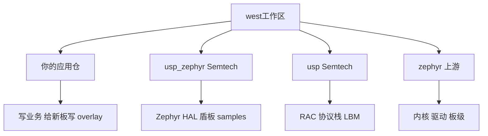
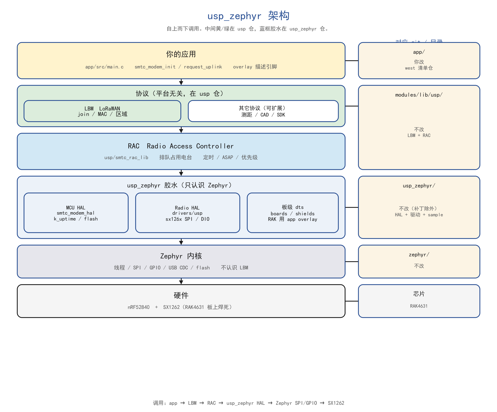
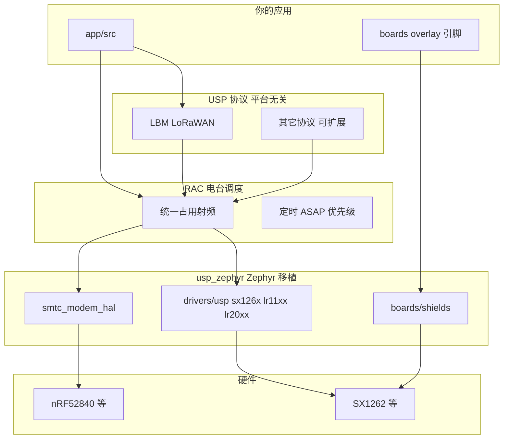
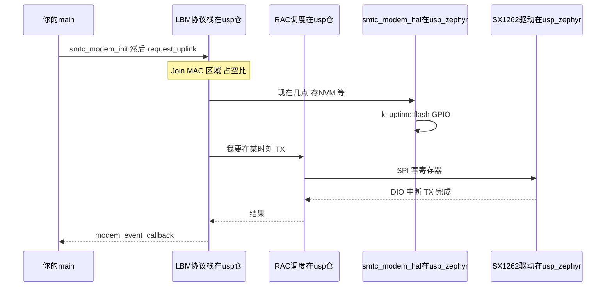
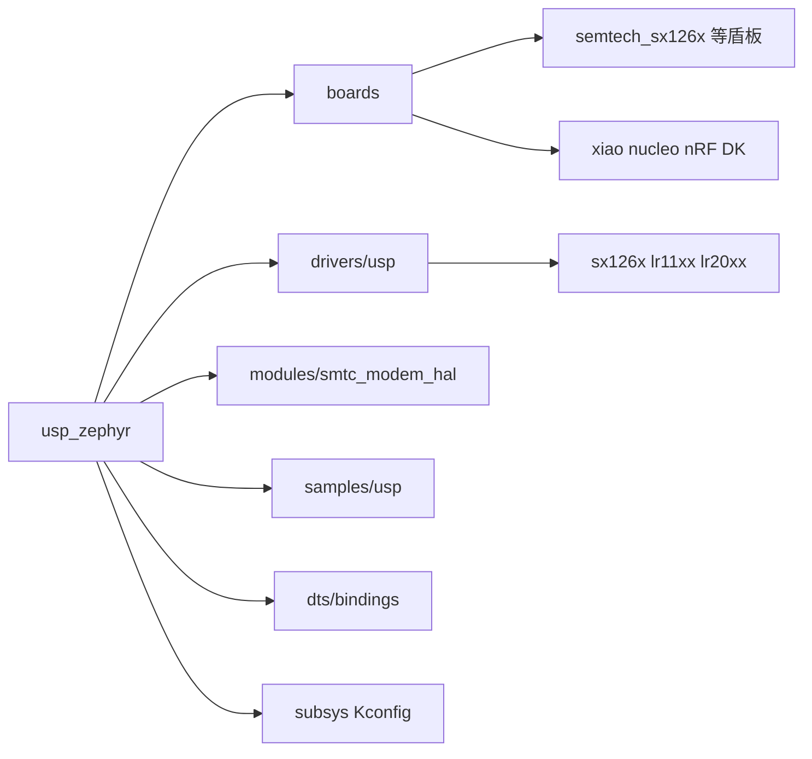
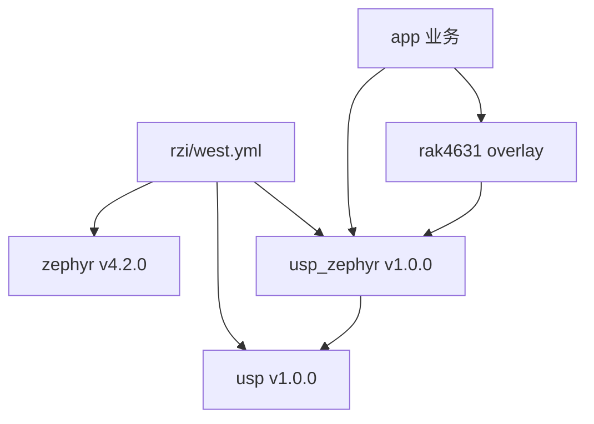

# usp_zephyr 框架

Semtech 的 **USP**（Unified Software Platform）把电台调度、LoRaWAN 等协议做成平台无关的库；**usp_zephyr** 是它在 Zephyr 上的胶水（MCU HAL、Radio HAL、盾板 dts、samples）。

你只改 **应用仓库**。`usp_zephyr` 和 `usp` 当 west module 拉下来，不要改它们的源码。

官方说明：[Lora-net/usp_zephyr](https://github.com/Lora-net/usp_zephyr)、[USP_Architecture.md](https://github.com/Lora-net/usp_zephyr/blob/main/doc/USP_Architecture.md)。和 Zephyr、LBM 的三角关系见 [三者关系](./usp-lbm-zephyr.md)。LBM 内部从 API 到 MAC 见 [LBM 分层](./lbm-layers.md)。

---

## 1. 四个盒子，只有两个是 Semtech 的仓



| 目录（west update 之后） | Git | 你改不改 |
|--------------------------|-----|----------|
| `app/` | 你的仓库 | 改 |
| `usp_zephyr/` | [Lora-net/usp_zephyr](https://github.com/Lora-net/usp_zephyr) | 不改 |
| `modules/lib/usp/` | [Lora-net/usp](https://github.com/Lora-net/usp) | 不改 |
| `zephyr/` | zephyrproject-rtos/zephyr | 不改 |

`west.yml` 把后三个变成依赖。USP 验证过的组合是 **Zephyr v4.2.0** + usp_zephyr **v1.0.0**。

---

## 2. 运行时分层（应用往下看到电台）

上面是你的 `main`，最下面是 SX1262。中间 **RAC**（Radio Access Controller）排队：LoRaWAN、测距不能同时占射频。右侧是对应 git：LBM 和 RAC 在 `usp` 仓，胶水在 `usp_zephyr` 仓。

打开本文件请用 Markdown 预览（`Ctrl+Shift+V`）。





三块职责：

- **RAC**（在 `usp` 仓）：谁用射频、何时发、冲突时谁让路。
- **LBM**（也在 `usp` 仓）：LoRaWAN 1.0.4、区域参数、FUOTA 包、Relay 等。
- **usp_zephyr**：把 RAC/LBM 接到 Zephyr 的 SPI/GPIO/定时器，以及 Semtech 盾板的 dts。

样品在 `usp_zephyr/samples/usp/` 下分三类：`lbm/`、`rac/`、`sdk/`。先看 LBM 的 `periodical_uplink` 最容易对上「入网发一包」。

---

## 2.1 usp_zephyr 和 LBM 怎么接在一起

容易混的一点：**LBM 的源码不在 `usp_zephyr` 里。**

- **LBM**（LoRa Basics Modem）= LoRaWAN 协议栈，在 **`usp` 仓** 的 `protocols/lbm_lib/`。它不认识 Zephyr，只认识两样东西：
  1. `smtc_modem_*` 给应用的 API（join、uplink）
  2. `smtc_modem_hal_*` 以及「找 RAC 要射频」——时间、存储、中断、SPI 发一包
- **usp_zephyr** = 把上面这些洞用 Zephyr 填上，并且用 CMake 把 `lbm_lib` 的 `.c` **编进你的固件**。

可以想成：LBM 是不会开车的导航仪；usp_zephyr 是方向盘、油门和仪表（Zephyr 的 SPI/GPIO/timer/flash）；RAC 是唯一能碰电台的调度员。LBM 要发 LoRaWAN 包，必须先问 RAC。



构建时也是「usp_zephyr 来编 LBM」，不是 LBM 自己进 Zephyr：

```text
west update
  usp_zephyr/modules/usp/CMakeLists.txt
    若 CONFIG_USP_LORA_BASICS_MODEM=y
      把 modules/lib/usp/protocols/lbm_lib 里的 .c 加进 zephyr_library
      同时编 usp_zephyr/modules/smtc_modem_hal/*.c
      同时编 RAC + sx126x/lr11xx 驱动
```

`prj.conf` 里的 `CONFIG_LORA_BASICS_MODEM_CLASS_C=y` 经 CMake 接口库 `lbm_compile_definitions` 变成 LBM 源码里的 `#define ADD_CLASS_C`。应用若要用同一套宏，CMakeLists 里写：

```cmake
target_link_libraries(app PRIVATE lbm_compile_definitions)
```

运行时你的 `main` 必须 **先 RAC、后 LBM**（官方 sample `periodical_uplink`）：

```c
SMTC_SW_PLATFORM_INIT();
SMTC_SW_PLATFORM_VOID(smtc_rac_init());      /* 电台调度先起来 */
SMTC_SW_PLATFORM_VOID(smtc_modem_init(&cb)); /* LBM 挂在 RAC 上 */

while (1) {
    smtc_modem_run_engine();   /* 跑 LoRaWAN 状态机 */
    smtc_rac_run_engine();     /* 跑射频队列 */
}
```

只调 `smtc_modem_init` / `smtc_modem_run_engine`（老 LBM 裸机写法）在 USP 里不够：LBM 已经改成通过 RAC 碰电台。

和 Zephyr 树上那份 `modules/lib/lora-basics-modem`、`CONFIG_LORAWAN` **不是同一条栈**。接 USP 就走 `CONFIG_USP` + `CONFIG_USP_LORA_BASICS_MODEM`，不要两套同时驱一颗 SX1262。

---


## 3. usp_zephyr 仓库里面有什么



对应目录：

```text
usp_zephyr/
  boards/           官方 MCU 板 + Semtech 射频盾板 overlay
  drivers/usp/      电台 HAL（sx126x / lr11xx / lr20xx）
  modules/          MCU HAL（给 LBM/USP 用的 Zephyr 实现）
  samples/usp/      lbm | rac | sdk 示例
  dts/bindings/     USP 用的设备树绑定（和 Zephyr 自带 semtech,sx1262 不是同一套）
  zephyr/module.yml 告诉 west：这是一个 Zephyr module
  west.yml          仅当「usp_zephyr 自己当老板」时用；产品应用应自己写清单
```

`zephyr/module.yml` 会登记 `board_root`、`dts_root`，所以 `west update` 之后构建系统能看见这些板和 bindings。

---

## 4. 和你现在 rzi 的关系

现在是 **Zephyr 当老板**（`zephyrproject/.west` → `zephyr/west.yml`），`app/` 在工作区外面。

要加 USP，官方推荐改成 **应用当老板**，工作区根就是 `rzi/`：

```text
rzi/                          你的 git = west 工作区根
  west.yml                    锁 zephyr / usp_zephyr / usp 的 revision
  app/                        只改这里
  usp_zephyr/                 west 拉下来
  modules/lib/usp/            west 拉下来
  zephyr/                     west 拉下来（建议先钉 v4.2.0）
```



编译仍是：`find_package(Zephyr)` + 目标名 `app`。打开的是 USP 的 `CONFIG_*`，不要和树上的 `CONFIG_LORA` / `loramac-node` 同时驱同一颗 SX1262。

---

## 5. RAK4631 落在哪一层

官方 sample 是 **MCU 开发板 + `--shield` 射频盾**。RAK4631 是 **板上焊死的 SX1262**，没有现成 shield 名。

| 层 | RAK4631 怎么做 |
|----|----------------|
| 应用 | 继续写在 `app/src` |
| 协议 / RAC | 用 `usp`，不用再实现 |
| Zephyr 内核 / nRF52840 | 用现成 `rak4631/nrf52840` |
| 射频 dts | 在 `app/boards/rak4631_nrf52840.overlay` 按 USP bindings 描述板上 SX1262（对照 `usp_zephyr/boards/shields/semtech_sx126xmb2xxs/`），不要改 `usp_zephyr/` 里的盾板 |

板级 dts 里已有 Zephyr 驱动节点 `compatible = "semtech,sx1262"`。接 USP 时要改成 **USP 那套 binding**，两套驱动不要同时绑这颗芯片。

---

## 6. 线程（知道有这档事即可）

- `CONFIG_USP_MAIN_THREAD=n`：应用自己调 USP/RAC（单线程）。
- `CONFIG_USP_MAIN_THREAD=y`：USP 自己跑线程；协作式或抢占+互斥。

对外 API 通过 `SMTC_SW_PLATFORM` 包一层，应用侧调用方式一样。细节见官方 [THREAD_MANAGEMENT.md](https://github.com/Lora-net/usp_zephyr/blob/main/doc/THREAD_MANAGEMENT.md)。

---

## 7. 先记这三句

1. **两个 Semtech 仓**：`usp` = 协议和 RAC；`usp_zephyr` = Zephyr 移植和板级。
2. **你的仓只放应用 + overlay + west.yml**。
3. **RAK4631 的工作是 overlay 移植，不是把 usp_zephyr 拷进 app/**。
